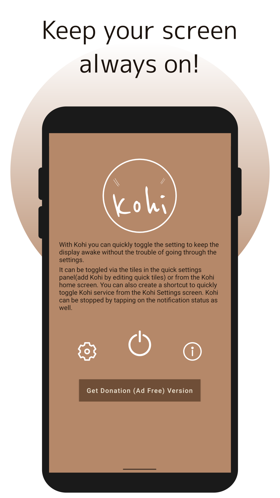
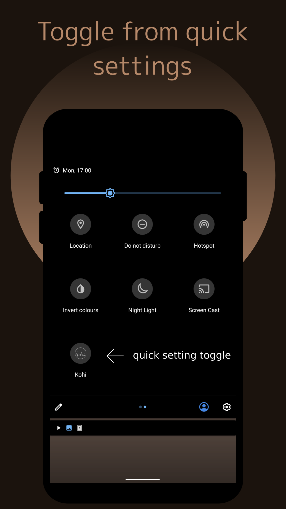
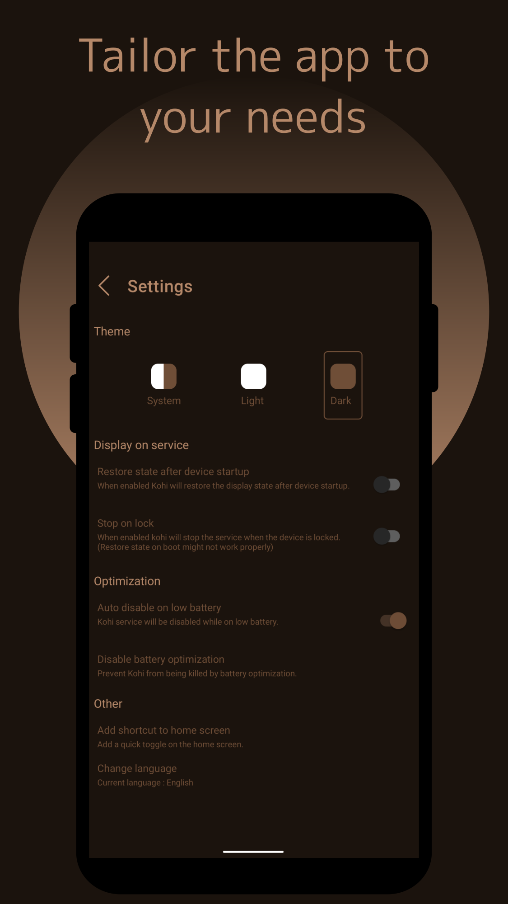

# Kohi

Keep your screen/display awake (on) as long as you want with just one click.
Instead of messing around in the settings, directly toggle the screen on service from the quick settings tile.

-------------------------------------------------
Kohi – Features
-------------------------------------------------

- Keep display always on
- Direct toggle via quick settings (add Kohi by editing the quick settings menu)
- Quick toggle shortcut via home screen
- Automatic shutdown on low battery
- Disable when device is locked
- Auto start service after device start up

We hope this app serves you well.

Kohi is developed by Arupakaman Studios.
Arupakaman Studios is a group of independent developers working on various applications and services.

You can send us your feedback and app suggestions via email.

## Contact Us

Contact us at: [arupakamanstudios@gmail.com](mailto:arupakamanstudios@gmail.com)

## Licensing

Slide is licensed under the [GNU v3 Public License.](LICENSE)